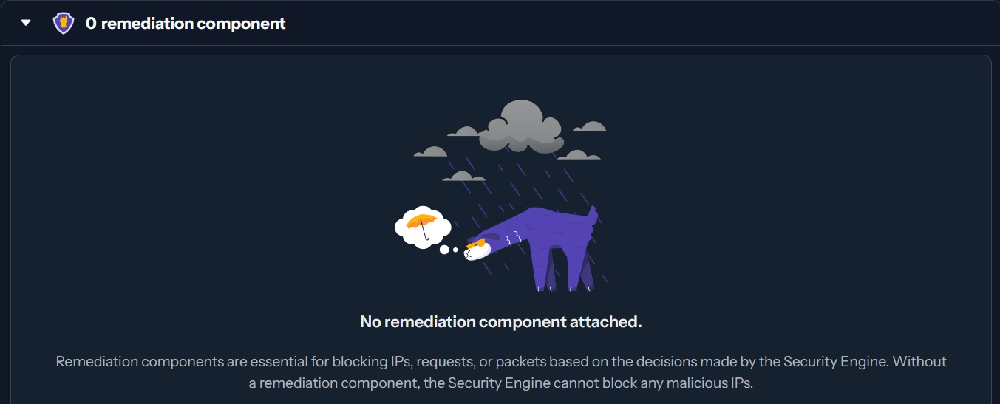

# CrowdSec on Synology DSM 6.x (DS218+)

Complete guide for running CrowdSec with a firewall bouncer on Synology DSM 6.x (kernel 4.4.302+). This setup protects Nginx and Docker container services by blocking malicious IPs at the iptables level.

## Why This Exists

CrowdSec's standard firewall bouncer installation assumes a modern Linux environment with a recent kernel, nftables support, full ipset capabilities, and the ability to install packages via `apt`. Synology DSM 6.x on the DS218+ has none of these.

The DS218+ runs kernel 4.4.302+, which is too old for nftables, only supports the `hash:ip` ipset type, is missing the `xt_comment` iptables extension module entirely, and doesn't load the `xt_set` module needed for ipset matching by default. You can't install the bouncer natively because DSM doesn't have a package manager for arbitrary binaries, and the official install script fails.

This guide runs both the CrowdSec engine and the firewall bouncer in Docker containers, with a custom-built bouncer image that works around every kernel limitation. The bouncer image forces `iptables-legacy` mode (since the default `iptables-nft` backend crashes immediately on this kernel), uses wrapper scripts that silently strip the unsupported `-m comment` iptables arguments that the bouncer insists on adding, and configures the `hash:ip` ipset type — the only one the kernel supports. A boot script ensures the required kernel modules are loaded before Docker starts the containers.

The result is a fully functional CrowdSec deployment that blocks malicious IPs at the iptables level for both host services (via the `INPUT` chain) and Docker containers (via the `DOCKER-USER` chain), with escalating ban durations and optional Matrix notifications — all on hardware that CrowdSec was never designed to run on.

## Architecture

```
Internet → Port Forward → DS218+ iptables
                              ↓
                    CROWDSEC_CHAIN (ipset)
                      ↓ (if not banned)
                 ┌────┴────┐
                 INPUT    DOCKER-USER
                 (host)   (containers)
                   ↓          ↓
                 SSH/etc   Nginx/Matrix/etc
```

- **CrowdSec Engine** (Docker): Parses Nginx access/error logs for malicious behaviour
- **Firewall Bouncer** (Docker): Receives ban decisions from the engine and applies them via iptables + ipset
- Banned IPs are DROPped in both the `INPUT` chain (host traffic) and `DOCKER-USER` chain (container traffic)

## DSM 6.x Kernel Limitations & Workarounds

The DS218+ runs kernel 4.4.302+ which has several limitations this setup works around:

| Issue | Workaround |
|-------|------------|
| `iptables-nft` not supported (no nf_tables) | Force `iptables-legacy` via `update-alternatives` in Docker image |
| Only `hash:ip` ipset type available | Set `ipset_type: hash:ip` in bouncer config |
| `xt_comment` kernel module missing | iptables wrapper scripts strip `-m comment` args |
| `xt_set` module not loaded by default | Boot script in `/usr/local/etc/rc.d/` to auto-load |

## Prerequisites

- Synology DS218+ running DSM 6.x
- Docker package installed via Package Center
- Nginx (native Synology package or Docker) serving your sites
- SSH access with sudo/root

> **Note:** This guide uses `/volumeX/` as the volume path. Replace `X` with your actual volume number (e.g. `/volume1/`, `/volume2/`). You can check yours with `ls /volume*`.

## Directory Structure

```
/volumeX/docker/
├── crowdsec/                          # CrowdSec engine
│   ├── docker-compose.yml
│   ├── config/                        # Bind-mounted to /etc/crowdsec
│   │   ├── profiles.yaml              # Escalating ban durations
│   │   └── notifications/
│   │       └── matrix.yaml            # Optional Matrix notifications
│   ├── data/                          # Bind-mounted to /var/lib/crowdsec/data
│   └── acquis.d/                      # Log acquisition configs
│       └── nginx.yaml
└── crowdsec-firewall-bouncer/         # Firewall bouncer
    ├── Dockerfile
    ├── bouncer-bin                    # Downloaded binary
    ├── iptables-wrapper               # Wrapper to strip --comment args
    ├── ip6tables-wrapper
    └── crowdsec-firewall-bouncer.yaml # Bouncer config
```

## Setup

### 1. Load Required Kernel Modules

```bash
# Load modules (needed before starting the bouncer)
sudo modprobe ip_set
sudo modprobe ip_set_hash_ip
sudo modprobe xt_set
```

Create a boot script so these load automatically after reboot:

```bash
cat << 'EOF' | sudo tee /usr/local/etc/rc.d/crowdsec-modules.sh
#!/bin/sh
case "$1" in
    start)
        modprobe ip_set
        modprobe ip_set_hash_ip
        modprobe xt_set
        ;;
    stop)
        ;;
esac
EOF
sudo chmod +x /usr/local/etc/rc.d/crowdsec-modules.sh
```

### 2. CrowdSec Engine

Create the directory structure:

```bash
sudo mkdir -p /volumeX/docker/crowdsec/{config,data,acquis.d}
```

Copy `crowdsec-engine/docker-compose.yml` and `crowdsec-engine/acquis.d/nginx.yaml` to the appropriate locations.

```bash
cd /volumeX/docker/crowdsec
sudo docker-compose up -d
```

Install collections:

```bash
sudo docker exec crowdsec cscli collections install crowdsecurity/nginx
sudo docker exec crowdsec cscli collections install crowdsecurity/http-cve
sudo docker exec crowdsec cscli collections install crowdsecurity/linux
```

### 3. Enroll in CrowdSec Console (Optional)

```bash
sudo docker exec crowdsec cscli console enroll YOUR_ENROLL_KEY --name "YOUR-SERVER-NAME"
sudo docker restart crowdsec
```

Get your enroll key from [app.crowdsec.net](https://app.crowdsec.net).

### 4. Firewall Bouncer

#### Download the bouncer binary

```bash
sudo mkdir -p /volumeX/docker/crowdsec-firewall-bouncer
cd /volumeX/docker/crowdsec-firewall-bouncer

# Download the latest release binary (Linux amd64)
# Check https://github.com/crowdsecurity/cs-firewall-bouncer/releases for latest
BOUNCER_VERSION="v0.0.34"
wget "https://github.com/crowdsecurity/cs-firewall-bouncer/releases/download/${BOUNCER_VERSION}/crowdsec-firewall-bouncer-linux-amd64.tgz" -O bouncer.tgz
tar xzf bouncer.tgz
mv crowdsec-firewall-bouncer-linux-amd64*/crowdsec-firewall-bouncer bouncer-bin
rm -rf bouncer.tgz crowdsec-firewall-bouncer-linux-amd64*
```

#### Register the bouncer with the engine

```bash
sudo docker exec crowdsec cscli bouncers add firewall-bouncer
```

Save the API key it outputs — you'll need it for the bouncer config.

#### Copy config files

Copy the following files from this repo's `crowdsec-firewall-bouncer/` directory:
- `Dockerfile`
- `iptables-wrapper`
- `ip6tables-wrapper`
- `crowdsec-firewall-bouncer.yaml` (update the `api_key` with the key from above)

#### Build and run

```bash
cd /volumeX/docker/crowdsec-firewall-bouncer
sudo docker build -t crowdsec-firewall-bouncer:local .
sudo docker run -d \
  --name crowdsec-firewall-bouncer \
  --restart unless-stopped \
  --network host \
  --cap-add NET_ADMIN \
  --cap-add NET_RAW \
  -v /volumeX/docker/crowdsec-firewall-bouncer/crowdsec-firewall-bouncer.yaml:/etc/crowdsec/bouncers/crowdsec-firewall-bouncer.yaml:ro \
  crowdsec-firewall-bouncer:local
```

### 5. Verify

```bash
# Check bouncer logs (should show "Processing new and deleted decisions")
sudo docker logs crowdsec-firewall-bouncer 2>&1 | tail -10

# Verify iptables chains are set up
sudo docker exec crowdsec-firewall-bouncer iptables-legacy -L CROWDSEC_CHAIN -n --line-numbers
sudo docker exec crowdsec-firewall-bouncer iptables-legacy -L DOCKER-USER -n --line-numbers
sudo docker exec crowdsec-firewall-bouncer iptables-legacy -L INPUT -n --line-numbers | head -5

# Test with a manual ban
sudo docker exec crowdsec cscli decisions add --ip 1.2.3.4 --reason "test ban" --duration 2m
sleep 12
sudo docker exec crowdsec-firewall-bouncer ipset list crowdsec-blacklists-0

# Clean up test ban
sudo docker exec crowdsec cscli decisions delete --ip 1.2.3.4

# Check bouncer is registered
sudo docker exec crowdsec cscli bouncers list
```

### 6. IP Whitelisting

Create a custom whitelist so your own IPs are never banned:

```bash
cat << 'EOF' | sudo tee /volumeX/docker/crowdsec/config/parsers/s02-enrich/custom-whitelists.yaml
name: custom/whitelists
description: "Whitelist trusted IPs"
whitelist:
  reason: "Trusted IPs"
  ip:
    - "YOUR_HOME_IP"
    - "YOUR_WORK_IP"
EOF
sudo docker restart crowdsec
```

Verify:
```bash
sudo docker exec crowdsec cscli parsers list | grep white
```

### 7. Escalating Ban Durations (Optional)

The included `profiles.yaml` configures escalating bans — repeat offenders get longer bans:

- 1st offence: 24 hours
- 2nd offence: 48 hours
- 3rd offence: 72 hours
- ...and so on

### 8. Matrix Notifications (Optional)

If you have a Matrix homeserver, CrowdSec can send alerts to a Matrix room when bans are applied. See `crowdsec-engine/config/notifications/matrix.yaml` for the template.

Register the notification in `profiles.yaml` under the `notifications` key.

## Troubleshooting

### `iptables v1.8.9 (nf_tables): Could not fetch rule set generation id`
The container is using nf_tables mode. Rebuild the Docker image — ensure `update-alternatives --set iptables /usr/sbin/iptables-legacy` is in the Dockerfile.

### `unable to find ipset`
The ipset package is missing from the Docker image. Ensure `ipset` is in the `apt-get install` line of the Dockerfile.

### `Kernel error received: set type not supported`
The kernel only supports `hash:ip` ipset type. Set `ipset_type: hash:ip` in the bouncer config.

### `Extension comment revision 0 not supported, missing kernel module?`
The `xt_comment` kernel module doesn't exist on DSM 6.x. The iptables wrapper scripts handle this by stripping `-m comment` arguments.

### Bouncer shows "connection refused" to API
Ensure the CrowdSec engine exposes port 8080 on all interfaces (`8080:8080` not `127.0.0.1:8080:8080` in docker-compose.yml), since the bouncer runs on the host network.

### DOCKER-USER chain warning
If you see "The DOCKER-USER chain exists, but is not configured for use by the bouncer", add `DOCKER-USER` to `iptables_chains` in the bouncer config.

### Console shows "No remediation component attached"



This is a cosmetic issue only. The CrowdSec Console identifies remediation components by their user-agent string. Since we're running a raw bouncer binary inside a custom Docker image, the Console doesn't recognise it — even though the bouncer is actively connected and blocking IPs.

You can verify the bouncer is working with:

```bash
sudo docker exec crowdsec cscli bouncers list
```

This should show the `firewall-bouncer` with a recent "Last API pull" timestamp and a ✔️ in the Valid column.

### Rules don't survive reboot
Ensure `/usr/local/etc/rc.d/crowdsec-modules.sh` exists and is executable. The iptables rules are recreated each time the bouncer container starts, but the kernel modules must be loaded first.

## License

MIT
